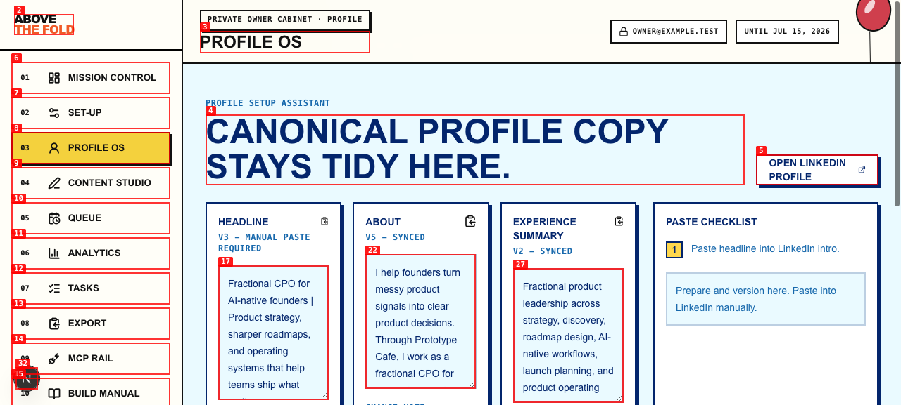
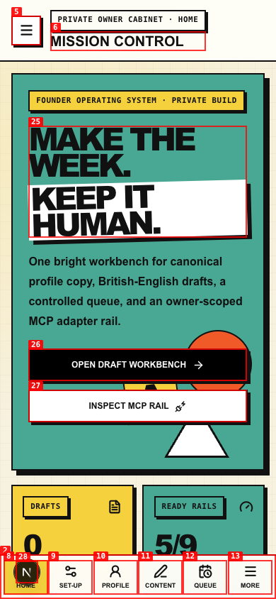
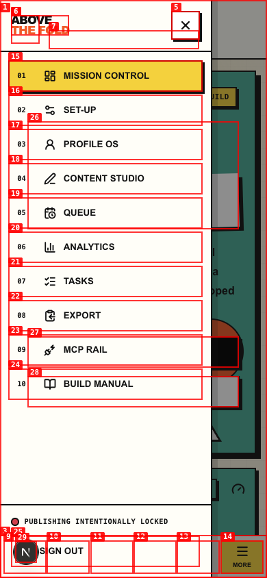
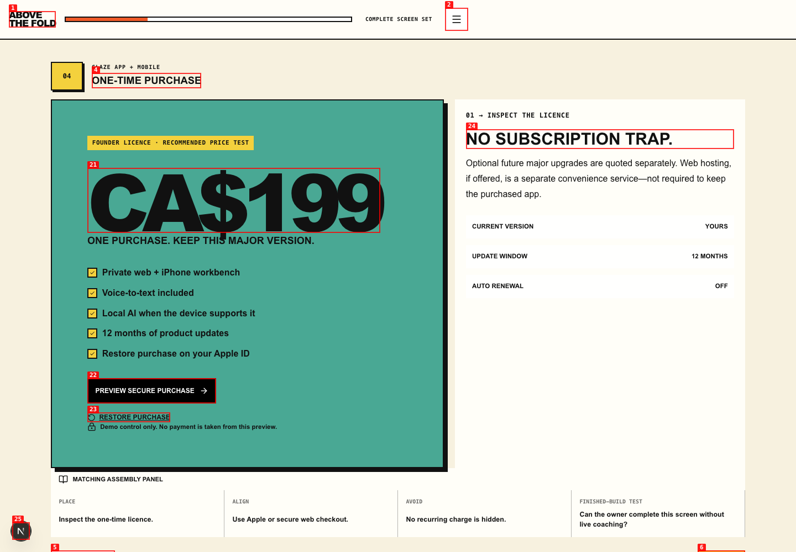

# Dogfood Report: Founder Above the Fold

| Field | Value |
|---|---|
| Date | 2026-07-14 |
| App URL | http://localhost:3100 |
| Session | founder-above-fold-qa |
| Scope | Full owner web workflow, desktop and mobile |

## Summary

| Severity | Count |
|---|---:|
| Critical | 0 |
| High | 0 |
| Medium | 4 |
| Low | 0 |
| **Total** | **4** |

## Issues

### ISSUE-001: Canonical profile editors have no accessible names

| Field | Value |
|---|---|
| Severity | medium |
| Category | accessibility |
| URL | http://localhost:3100/dashboard · Profile OS |
| Repro Video | N/A — static accessibility-tree defect |

**Description**

The Headline, About, and Experience content editors appear in the browser accessibility tree as three unnamed textboxes. Sighted labels are present elsewhere on each card, but they are not programmatically attached to the editor. A screen-reader user cannot reliably distinguish the fields.

**Repro Steps**

1. Sign in, open the private workbench, and select **Profile OS**.
2. Inspect the three canonical-copy cards with the browser accessibility tree.
3. **Observe:** each main content editor is announced only as “textbox”; the optional note fields are named correctly.

**Repair**

Fixed in the same pass. The repeated accessibility-tree check now exposes “Headline canonical copy”, “About canonical copy”, and “Experience summary canonical copy”, with matching field-specific change-note labels.

### ISSUE-002: Closed mobile navigation remains in the accessibility tree

| Field | Value |
|---|---|
| Severity | medium |
| Category | accessibility / responsive UI |
| URL | http://localhost:3100/dashboard · 390×844 viewport |
| Repro Video | N/A — static responsive accessibility defect |

**Description**

At mobile width, the closed off-canvas rail is visually displaced but all ten rail buttons, “Close menu”, and “Sign out” remain exposed to the accessibility tree alongside the visible mobile dock. Keyboard and screen-reader users can reach controls they cannot see.

**Repro Steps**

1. Open the authenticated dashboard at a 390×844 viewport.
2. Leave the **More** rail closed.
3. Inspect the accessibility tree.
4. **Observe:** both the visible mobile dock and the closed rail controls are present.

**Repair**

Fixed in the same pass. The closed rail now uses visibility and pointer-event locks at mobile widths; the repeated 390×844 accessibility snapshot exposes only the visible top-bar menu control and mobile dock. Opening the rail or crossing the desktop breakpoint restores it.

### ISSUE-003: Open mobile rail does not isolate the page behind it

| Field | Value |
|---|---|
| Severity | medium |
| Category | accessibility / UX |
| URL | http://localhost:3100/dashboard · mobile More rail open |
| Repro Video | N/A — static accessibility-tree defect |

**Description**

When the mobile rail is open, the page, mobile dock, top-bar menu button, and backdrop button remain reachable. The tree exposes two “Close menu” buttons and both navigation systems, so focus is not isolated to the modal rail.

**Repro Steps**

1. Open the dashboard at a mobile viewport.
2. Select **More**.
3. Inspect the accessibility tree.
4. **Observe:** rail controls and all underlying page controls remain reachable together.

**Repair**

Fixed in the same pass. The rail now exposes modal semantics; the stage and dock become inert and hidden from assistive technology; the backdrop is no longer focusable or announced. The repeated snapshot contains only rail controls (plus Next.js’s development-only tool button, which is absent from production).

### ISSUE-004: Closed commercial screen index remains reachable

| Field | Value |
|---|---|
| Severity | medium |
| Category | accessibility / responsive UI |
| URL | http://localhost:3100/pricing |
| Repro Video | N/A — static accessibility-tree defect |

**Description**

The 14-screen commercial index is visually off canvas on initial load, but the accessibility tree includes “Close screen index” and every screen selector. This duplicates navigation and exposes invisible controls. The same background-isolation problem occurs when the index opens.

**Repro Steps**

1. Open the one-time licence route.
2. Leave the screen index closed.
3. Inspect the accessibility tree.
4. **Observe:** all 14 off-canvas controls remain reachable.

**Repair**

Fixed in the same pass. Closed-state snapshots now exclude the index entirely. Open-state snapshots expose only the modal screen list; the header, stage, and backdrop are inert/hidden from assistive technology (apart from Next.js’s development-only tool button).
